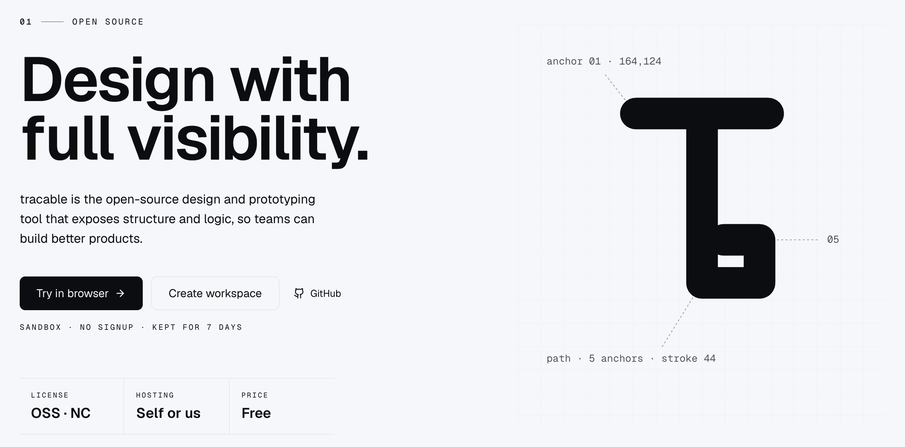
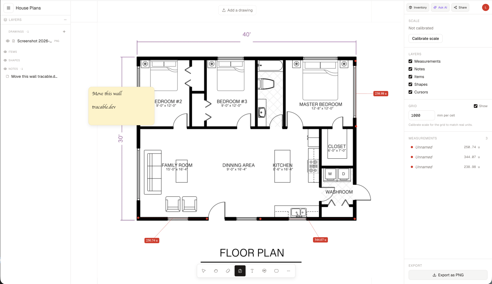

# tracable

A browser-based collaborative canvas for measuring, annotating, and
sharing technical drawings — DWG, DXF, PDF, SVG, PNG, JPG, GIF, WEBP,
BMP. Drop a floor plan, calibrate it to real units, place items from
your inventory, leave sticky notes, and ship a marked-up version to a
client over a password-protected link. No accounts required for the
sandbox; full multi-tenant orgs for paid teams.

Live at **[tracable.dev](https://tracable.dev)**.





> **License**: source-available under the **Elastic License 2.0** —
> see [LICENSE](./LICENSE). You can self-host, modify, and use it
> commercially in your own work; you cannot offer it as a hosted/SaaS
> product to third parties or resell it as a cloud service.

---

## What it does

- **Drop a drawing**, any common 2D format. DWG is converted to DXF
  in the browser at upload time so the rest of the pipeline only sees
  DXF.
- **Calibrate scale** by clicking two points and entering their real
  distance. After that, every measurement is shown in mm/cm/m/in/ft.
- **Measure** with snap-to-endpoint precision. Labels are draggable
  so they don't overlap.
- **Annotate** with sticky notes (rich-text, draggable, URL-aware),
  shapes (line/rect/text), and pinned items from your inventory.
- **Inventory** of furniture/fixtures with real dimensions; drag onto
  the canvas at scale, rotate, resize, lock.
- **Live collaboration**: cursors, draft lines, presence avatars in
  the right panel.
- **AI assistant** (Claude) embedded in the canvas — sees your page,
  suggests measurements/items/notes you can accept with one click.
- **Share** via password-protected public link. Guests can view and
  optionally comment without making an account.
- **Export** the canvas as PNG.

---

## How it works (architecture)

Trace is a Next.js 14 app with a single Pixi v8 canvas that renders
the entire editor. State lives in a Zustand store; mutations are
optimistic, then persisted to Supabase, with realtime postgres-changes
roundtripping into the same store.

```
app/                       Next.js routes (App Router)
  layout.tsx               Root layout — fonts + analytics
  (marketing)/page.tsx     Marketing landing
  (auth)/{login,signup}    Magic-link + Google OAuth
  app/[orgSlug]/[projectId]/[pageId]/  THE EDITOR
  p/[slug]/                Public viewer (password gate)
  api/                     Server routes (orgs, invites, shares, AI)

components/
  canvas/Canvas.tsx        Pixi mount + interaction loop
  canvas/Editor.tsx        Editor wrapper (data, store, realtime)
  canvas/pixi/{*Layer}.ts  One file per Pixi layer
  canvas/parsers/          DXF / PDF / image / DWG parsers
  panels/Toolbar.tsx       Bottom-centre tools (V/H/M/N/T/L/R/C)
  panels/LayersPanel.tsx   Left panel: page header + every asset type
  panels/Inspector.tsx     Right panel: actions + selection properties
  panels/EditorActions.tsx Inventory / AI / Share / Profile (right)
  panels/EditorMobileBar.tsx  Mobile-only top bar
  analytics/AnalyticsProvider.tsx  GA + Mixpanel bootstrap

stores/editorStore.ts      Zustand: drawings, items, shapes, notes,
                           measurements, view, tool, selection,
                           cursors, layers, grid

lib/
  analytics/index.ts       track / identify / pageView
  realtime/page.ts         postgres-changes + broadcast + presence
  supabase/{client,server}.ts  Per-context clients
  email/send.ts            Resend wrapper (silent in dev)
  utils/                   geometry, units, idb cache, dwg, sanitiseSvg
```

### State + sync

- All annotations live in Zustand by row-UUID maps.
- Mutations are **optimistic**: write to the store, then upsert to
  Supabase. On error: surface and undo the local insert.
- `lib/realtime/page.ts` subscribes to postgres-changes for the
  page's measurements/notes/placed_items/shapes, plus broadcast
  channels for cursors and in-progress draft lines.
- Conflict resolution: last-write-wins per row UUID. Different rows
  never conflict.

### Permissions

- Org roles: `owner | admin | editor | viewer`. Source of truth is
  Supabase RLS (`supabase/migrations/0002_rls.sql`).
- The UI hides edit affordances for viewers but trusts RLS.
- Public sharing: `app/api/share/[slug]/*` server routes bypass RLS
  via the service-role key, gated by an HMAC cookie set after a
  correct password.

### Drawing pipeline

1. User drops a file → uploaded to Supabase Storage (`drawings`
   bucket).
2. Page row records the path + file type (or, for additional layers,
   a `page_drawings` row).
3. Editor fetches a signed URL, downloads the blob, hashes it, and
   looks the parsed result up in IndexedDB.
4. Cache miss → parse client-side (DWG → DXF → entities, PDF →
   image, etc.) and cache the parsed entities in IndexedDB.
5. Pixi `DrawingLayer` renders the entities; `Snapping` builds a
   vertex spatial index so the measure tool can snap to endpoints.

---

## Run it locally

Prereqs: [Bun](https://bun.sh), a Supabase project.

```bash
bun install
cp .env.example .env.local            # fill in the values, see below
bun run dev                           # http://localhost:3000
```

### 1. Supabase

Create a Supabase project, then either:

**Option A — automatic.** Set `SUPABASE_DB_URL` (the direct
connection string from Project Settings → Database → "Session
pooler") and run:

```bash
SUPABASE_DB_URL=postgres://... bun run migrate
```

The script creates a `_trace_migrations` tracking table on first run,
applies any new `.sql` file in `supabase/migrations/` in order, and
runs `supabase/seed.sql` at the end (idempotent).

**Option B — manual.** Open Supabase Studio → SQL Editor and paste:

- `supabase/migrations/0001_init.sql` — schema
- `supabase/migrations/0002_rls.sql` — Row Level Security
- `supabase/migrations/0003_storage.sql` — storage buckets + policies
- `supabase/migrations/0004_inventory.sql` — inventory + AI usage
- `supabase/migrations/0005_notes_drawings.sql` — note styling +
  multi-file layers
- `supabase/migrations/0006_placed_lock.sql` — lock flag on items
- `supabase/migrations/0007_shapes.sql` — line / rect / text shapes
- `supabase/migrations/0008_measurement_label_offset.sql` — draggable
  measurement labels
- `supabase/seed.sql` — default furniture/fixtures inventory

**Enable Realtime** for these tables (Database → Replication):

- `measurements`, `notes`, `pages`, `placed_items`, `page_drawings`,
  `shapes`

**Auth providers** (Authentication → Providers):

- Email magic-link is enabled by default.
- Google: paste your OAuth client ID/secret. Redirect URI is
  `https://YOUR-PROJECT.supabase.co/auth/v1/callback`.

**Site URL & redirect URLs** (Authentication → URL Configuration):

- **Site URL**: your **production URL** (e.g. `https://tracable.dev`),
  not localhost. Supabase falls back to this when the
  `emailRedirectTo` we pass isn't allowlisted, so a wrong value
  silently breaks signup emails.
- **Additional redirect URLs**:
  - `https://tracable.dev/auth/callback`
  - `https://*-your-vercel-team.vercel.app/auth/callback`
  - `http://localhost:3000/auth/callback`

**Email templates** (Authentication → Email Templates) — optional but
recommended. Override the **Magic Link** and **Confirm signup**
templates to point at our `/auth/confirm` endpoint, which uses the
token-hash flow and works across browsers/devices:

```html
<h2>Sign in to tracable</h2>
<p>
  <a href="{{ .SiteURL }}/auth/confirm?token_hash={{ .TokenHash }}&type=email&next=/app">
    Sign in
  </a>
</p>
<p>If you didn't request this, you can ignore this email.</p>
```

Use `type=email` for magic-link / signup, `type=invite` for invites.

### 2. Environment

| Variable | Where | Required | Notes |
|---|---|---|---|
| `NEXT_PUBLIC_SUPABASE_URL` | client + server | yes | Project settings → API |
| `NEXT_PUBLIC_SUPABASE_ANON_KEY` | client + server | yes | Anon key (public) |
| `SUPABASE_SERVICE_ROLE_KEY` | server only | yes | Sensitive — never expose to browser |
| `NEXT_PUBLIC_APP_URL` | client + server | yes | e.g. `https://tracable.dev` |
| `SHARE_COOKIE_SECRET` | server | yes | Long random string. Rotates kill all guest sessions |
| `RESEND_API_KEY` | server | optional | Without it, invites log to the console |
| `RESEND_FROM` | server | optional | Defaults to `tracable <onboarding@resend.dev>` |
| `ANTHROPIC_API_KEY` | server | optional | Without it, AI features show 503 |
| `ANTHROPIC_MODEL` | server | optional | Defaults to `claude-sonnet-4-5` |
| `NEXT_PUBLIC_GA_MEASUREMENT_ID` | client | optional | Google Analytics 4 ID |
| `NEXT_PUBLIC_MIXPANEL_TOKEN` | client | optional | Mixpanel project token |

`.env.example` is checked in.

### 3. Deploying to Vercel

1. Import the repo into Vercel.
2. Add every variable from `.env.example` to the Vercel project.
   Mark `SUPABASE_SERVICE_ROLE_KEY` and `SHARE_COOKIE_SECRET` as
   sensitive.
3. Set `SUPABASE_DB_URL` if you want migrations to run on every
   deploy (the `vercel-build` script invokes `bun run migrate`
   before `next build`).
4. Once deployed, set `NEXT_PUBLIC_APP_URL` to the production URL and
   add the production `/auth/callback` to the Supabase redirect
   allowlist.

---

## Analytics

Both Google Analytics (GA4) and Mixpanel are supported and **optional**.
If neither env var is set, the app emits nothing.

When configured, `<AnalyticsProvider />` mounts at the root layout,
boots both providers lazily on the client, and emits `page_view` on
every Next.js client navigation. Feature code calls
`track(EVENTS.x, props?)` from `lib/analytics`. See `EVENTS` in
[`lib/analytics/index.ts`](./lib/analytics/index.ts) for the canonical
list (project_create, page_create, drawing_upload, item_place,
ai_assistant_prompt, share_link_create, etc.).

User identification uses the Supabase auth UUID — never the email or
display name.

---

## Development notes

- `bun run typecheck` — strict TypeScript. Run before committing.
- `bun run dev` — Next dev server.
- `bun run build` — production build (no static export, all
  `force-dynamic`).
- Tailwind tokens live in `styles/tokens.css` — change the palette
  there. Don't add gradients or glassmorphism; the design language is
  restrained.
- Pixi v8 — the `MeasurementLayer` and `PlacedItemsLayer` use a
  counter-scale trick (`px(n) = n / viewport.zoom`) to keep dots,
  handles, and labels constant pixel size as the user zooms.
- Supabase types: hand-rolled in `lib/supabase/types.ts`. Replace
  with `bunx supabase gen types typescript` once you have a project
  ID.

---

## What's deferred

- DXF advanced entities: SPLINE, ELLIPSE, INSERT/blocks, HATCH.
- DWG fall-back when `libredwg-web` fails on 2019+ files. We tell
  the user to export to DXF/PDF instead.
- Multi-page PDFs: only page 1 is rendered.
- CRDT for fine-grained text editing (notes are last-write-wins
  today).
- Drag-and-drop on the canvas to reposition entire **drawing
  layers**. Items, shapes, and notes already support this.
- Cross-type reordering in the unified Layers panel — drawings have
  `sortOrder`, items/shapes have `z_order` controls in the
  Inspector but they don't share a single drag-to-reorder list yet.
- Free-tier quotas (`usage_limits` stub table).
- Auto-generated thumbnails (the `thumbnails` bucket exists).

---

## License

[Elastic License 2.0](./LICENSE) — source-available, free for
self-hosting and internal/commercial use, **but** you may not offer
tracable (or a substantial subset of its features) as a hosted /
managed / SaaS service to third parties. If you want a license for
that, contact the maintainers.
